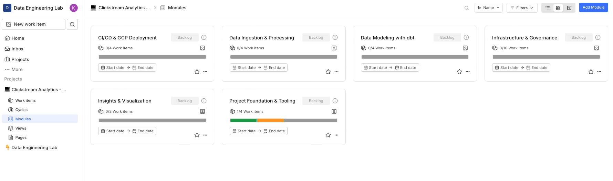
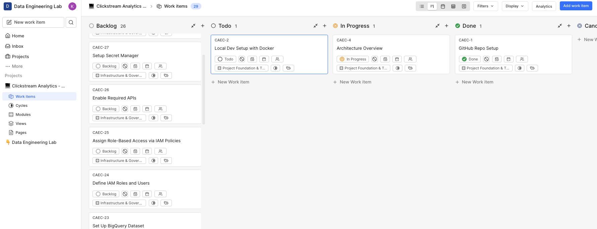
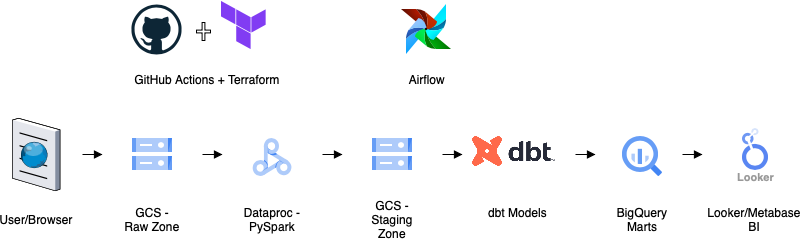
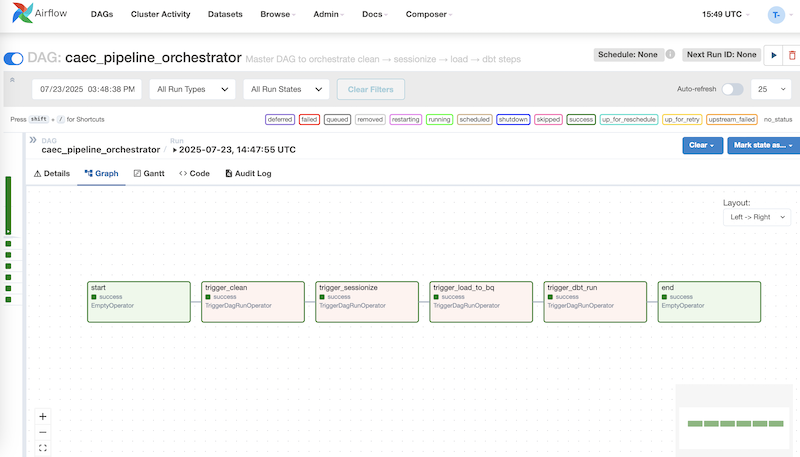
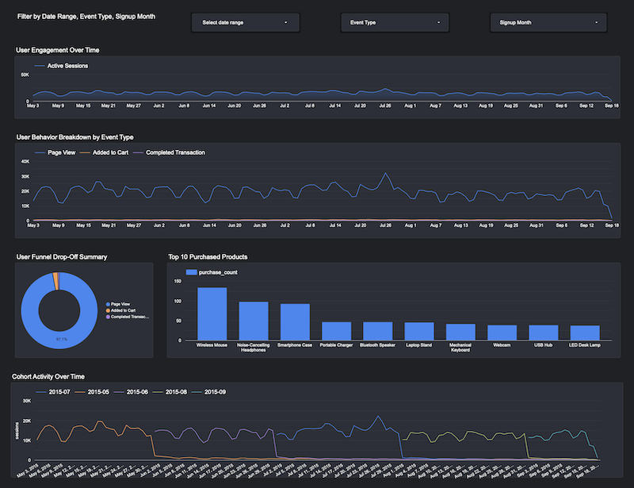

# Clickstream Analytics on GCP (CAEC)

A production‑ready reference implementation of an end‑to‑end clickstream analytics platform on Google Cloud.  
The stack is fully automated with Terraform, uses keyless GitHub Actions for CI/CD, and follows a strict
least‑privilege access model for operations, data engineering, and analyst personas.

---

## Table of Contents
1. [Project Overview](#project-overview)  
2. [Project Management](#project-management)  
3. [Key Features](#key-features)  
4. [Architecture Diagram](#architecture-diagram)  
5. [Technology Stack](#technology-stack)  
6. [Role Based Access Model](#role-based-access-model)  
7. [Infrastructure as Code](#infrastructure-as-code)  
8. [CI/CD Pipeline](#cicd-pipeline)
9. [Project Structure](#project-structure)  
10. [Pipeline Run](#pipeline-run)  
11. [Looker Studio Dashbaord](#looker-studio-dashboard)  
12. [Contributing & Issues](#contributing--issues)  
13. [License](#license)  

---

## Project Overview
CAEC ingests raw clickstream data, sessionizes it with Dataproc Serverless Spark jobs,
models it in BigQuery with dbt, and surfaces insights through authorized views consumed
by Looker Studio dashboards. All resources are provisioned via modular Terraform, and
deployments run from GitHub Actions using Workload Identity Federation—no long‑lived keys.

## Project Management

This project was fully managed using [Plane](https://app.plane.so/data-engineering-lab/projects/ccac21e9-0819-4691-b9fe-6df5ef4a0060/issues), an open-source project and issue tracking tool.





## Key Features
- **Serverless‑first data plane**: Dataproc Serverless + Cloud Composer.  
- **Keyless CI/CD**: GitHub Actions → GCP via OIDC Workload Identity Federation.  
- **Modular IaC**: Reusable Terraform modules for storage, compute, IAM, WIF, artifactory, bigquery, composer environment, KSA.
- **Strict least privilege**: Separate service accounts & IAM roles for Ops, Data Engineers, Analysts.  
- **Authorized Views**: Analysts query `caec_insights`, while the views read from `caec_analytics` privately.  
- **Environment parity**: `src/main/resources/etc/{dev,prod}.properties` drive config.  
- **Real data demo**: Sample clickstream dataset and Looker Studio dashboard (see `docs/looker/CAEC_Dashboard.pdf`).  

## Architecture Diagram



## Technology Stack
| Layer | Services / Tools |
| ----- | ---------------- |
| Ingestion & Processing | Dataproc Serverless (Spark), Python |
| Orchestration | Cloud Composer (Airflow 2) |
| Modeling | BigQuery, dbt |
| Visualization | Looker Studio |
| IaC | Terraform |
| CI/CD | GitHub Actions (OIDC) |
| Storage | Cloud Storage (raw, clean, sessionized) |

## Role Based Access Model
| Persona | Service Account | Key IAM Roles | Scope |
| ------- | --------------- | ------------- | ----- |
| **Ops** | `caec-ops-sa` | `roles/owner` (lab scope only), monitoring roles | Full admin in dev project |
| **Data Engineer** | `caec-data-eng-sa` | `roles/bigquery.jobUser`, `roles/storage.objectAdmin`, Dataproc submit | Build & run pipelines |
| **Analyst** | `caec-analyst-sa` | `roles/bigquery.dataViewer` on `caec_insights` only | Query insights, no raw data |

> **Authorized Views**: `caec_insights.*` views read underlying tables in `caec_analytics` without granting analysts direct access to the source dataset.

## Infrastructure as Code
Terraform code lives under `terraform-infra/` and is split into reusable modules:
```
terraform/
├── modules/
│ ├── artifactory_registry/
│ ├── bigquery_dataset/
│ ├── composer_env/
│ ├── gcs_bucket/
│ ├── iam/
│ ├── ksa/
│ ├── project_apis/
├─└── wif_github/
```

Each module contains its own `README.md`; high‑level usage is documented in `docs/terraform.md`.

## CI/CD Pipeline
- **Workload Identity Federation** connects GitHub Actions runners to GCP.  
- Separate workflows for **build**, **deploy**, and **dbt run/tests**.   
- Status badge:

[](https://github.com/ThatiK/clickstream-analytics-gcp/actions/workflows/build-pipelines.yml)


## Project Structure
```
├── docs/
│ ├── looker/
│ ├── plane/
│ └── images/
├── src/
│ └── main/
│ ├── resources/
│ │ ├── etc/
│ │ │ ├── dev.properties
│ │ │ └── prod.properties
│ │ ├── ariflow/    # Airflow DAG definitions
│ │ ├── analytics/  # Views for Looker
│ │ ├── bigquery/   # DDLs
│ │ ├── dbt/        # dbt models
│ │ ├── python/
│ │ └── spark/
│ └── ...
├── terraform-infra/
└── README.md
```

## Pipeline Run


## Looker Studio Dashboard
[](docs/looker/CAEC_Dashboard.pdf)

## Contributing & Issues
This repository is part of a personal portfolio and is not actively maintained for external contributions.
Feel free to open issues or submit pull requests; turnaround time may vary.

## License
Distributed under the MIT License. See [LICENSE](LICENSE) for details.
